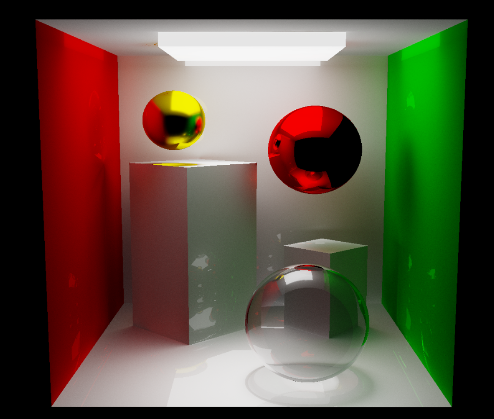

# PathTracer
This repository contains basic path tracer implementation in GLSL shaders. Oriented boxes and spheres are supported, all objects are set in the beggining of shader code.
All objects can diffuse, emit, reflect or refract light. For better results you can increase `MAX_DEPTH` and `uSamples` parameters in shader code.

This project depends on [MxEngine](https://github.com/asc-community/MxEngine) 3D engine. To build it, follow instructions described in [MxEngine template project](https://github.com/MomoDeve/MxEngineTemplate). If you have some trobles with building or running it, feel free to create an issue here or on MxEngine's issue page.

